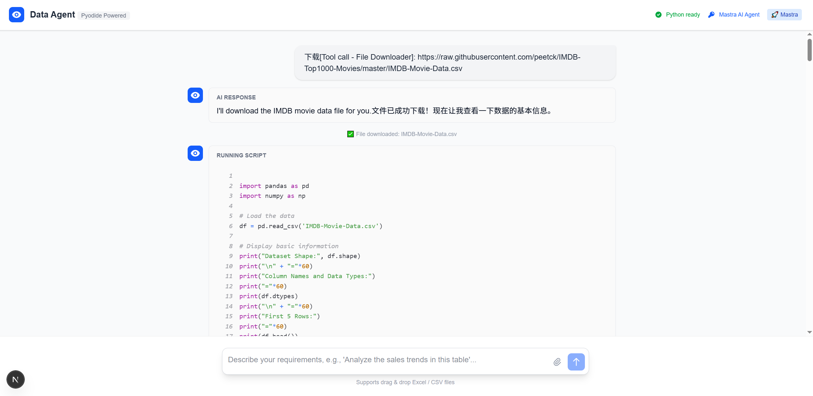
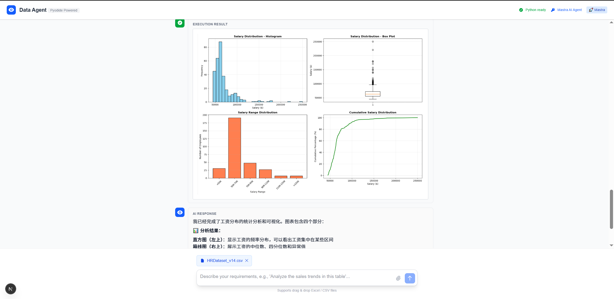

# 🐍 OpenDataChat - Open Source AI Data Analysis in Your Browser

<div align="center">


**Free. Open. Powerful. Chat with your data using AI - entirely in your browser.**

[Live Demo](https://open-data-chat-2z4s.vercel.app/) • [Quick Start](#quick-start) • [Features](#features) • [Examples](#usage-examples)

</div>

---

## 🎯 Try It Now - No Setup Required!

**Live Demo**: [https://open-data-chat-2z4s.vercel.app/](https://open-data-chat-2z4s.vercel.app/)

Want to try it immediately without any setup? Use our free API key:

1. Visit the [Live Demo](https://open-data-chat-2z4s.vercel.app/)
2. Click the 🔑 key icon in the top right corner
3. Enter this free API key:
   ```
   cr_940a0e6d7951390ea8399f7d2fe3cd5f3f5595414bda865ea91080c068b1befa
   ```
4. Click "Save" and start analyzing data!

> **Note**: This is a shared demo key with rate limits. For production use, please get your own API key from [console.anthropic.com](https://console.anthropic.com/).

---

## 🌟 What Makes This Special?

Imagine having a data scientist at your fingertips, ready to analyze any dataset you throw at it - all running **entirely in your browser**. No Python installation. No cloud credits. No privacy concerns.

**OpenDataChat** is an open-source project that combines the power of AI agents with browser-based Python execution to create the ultimate data analysis companion:

- 🤖 **AI-Powered Analysis**: Natural language interface powered by Claude Sonnet 4.5
- 🚀 **Runs Anywhere**: Pure browser-based Python execution with Pyodide
- 📊 **Full Python Stack**: NumPy, Pandas, Matplotlib - all in the browser
- 💬 **Chat Interface**: Just ask questions in plain English
- 🔒 **Privacy First**: Your data never leaves your browser
- 📥 **Smart File Handling**: Drag & drop or download from URLs
- ✨ **Real-time Streaming**: Watch analysis unfold as the agent thinks

## ✨ Features

### 🎯 Core Capabilities

- **Natural Language Queries**: "Show me the correlation between age and salary" - just ask!
- **Automatic Code Generation**: Agent writes and executes Python code for you
- **Intelligent Tool Use**: Automatically downloads files, runs analysis, creates visualizations
- **Streaming Responses**: See the agent's thought process in real-time
- **Interactive Visualizations**: Matplotlib charts rendered inline
- **File Management**: Upload CSV/Excel or provide URLs for automatic download
- **Conversation Memory**: Context-aware across multiple queries

### 🔧 Technical Features

- **Powered by Mastra Agent Framework**: Robust AI agent orchestration
- **Pyodide Integration**: Full Python 3.12 runtime in WebAssembly
- **Modern React UI**: Built with Next.js 15 and TypeScript
- **Tailwind CSS**: Beautiful, responsive design
- **Zero Backend**: Fully client-side (except AI API calls)
- **Easy Deployment**: Deploy to Vercel in seconds

## 🚀 Quick Start

### Prerequisites

- Node.js 18+
- An Anthropic API key ([get one here](https://console.anthropic.com/))

### Installation

```bash
# Clone the repository
git clone https://github.com/chenwenxiaolive/OpenDataChat.git
cd OpenDataChat

# Install dependencies
npm install

# Set up environment variables
# Create .env.local file and add your Anthropic API key:
echo "ANTHROPIC_AUTH_TOKEN=your_api_key_here" > .env.local

# Start the development server
npm run dev
```

Visit [http://localhost:54891](http://localhost:54891) and start analyzing!

## 💡 Usage Examples

### Example 1: Quick Data Exploration

```
You: "I have a CSV file with employee data. Can you show me the distribution of salaries by department?"

Agent: I'll analyze the salary distribution by department for you.
[Automatically loads data, generates Python code, creates visualization]
```

### Example 2: Download and Analyze

```
You: "Download https://example.com/sales-data.csv and show me the top 5 products"

Agent: I'll download the file and analyze the top products.
[Downloads file, processes data, shows results]
```

### Example 3: Complex Analysis

```
You: "Find correlations between employee satisfaction and performance scores, then create a heatmap"

Agent: Let me analyze the correlations and create a visualization.
[Runs statistical analysis, generates heatmap]
```

### Example 4: Time Series Analysis

```
You: "Plot the monthly sales trend for the last year with a moving average"

Agent: I'll create a trend analysis with moving averages.
[Processes time series data, creates multi-line plot]
```

## 🎨 Screenshots

### Download Files from URL
Download datasets directly from URLs and analyze them instantly.



### Interactive Visualizations
Create beautiful charts and visualizations with automatic code generation.



## 🏗️ Architecture

```
┌─────────────────────────────────────────────────────────────┐
│                         Browser                              │
│  ┌──────────────────────────────────────────────────────┐  │
│  │              Next.js Frontend                         │  │
│  │  ┌────────────────────────────────────────────────┐  │  │
│  │  │  Mastra Agent (Claude Sonnet 4.5)             │  │  │
│  │  │  - Natural Language Understanding              │  │  │
│  │  │  - Code Generation                             │  │  │
│  │  │  - Tool Orchestration                          │  │  │
│  │  └────────────────────────────────────────────────┘  │  │
│  │                      ↕                                │  │
│  │  ┌────────────────────────────────────────────────┐  │  │
│  │  │  Pyodide (Python 3.12 in WebAssembly)         │  │  │
│  │  │  - NumPy, Pandas, Matplotlib                   │  │  │
│  │  │  - Virtual File System                         │  │  │
│  │  │  - Code Execution                              │  │  │
│  │  └────────────────────────────────────────────────┘  │  │
│  └──────────────────────────────────────────────────────┘  │
└─────────────────────────────────────────────────────────────┘
```

## 🛠️ Tech Stack

- **Frontend**: Next.js 15, React 19, TypeScript
- **AI Agent**: Mastra Framework, Claude Sonnet 4.5
- **Python Runtime**: Pyodide 0.26 (Python 3.12)
- **Styling**: Tailwind CSS
- **Scientific Libraries**: NumPy, Pandas, Matplotlib
- **Deployment**: Vercel (recommended)

## 📦 Project Structure

```
OpenDataChat/
├── app/
│   ├── page.tsx                 # Main page
│   ├── api/
│   │   └── mastra-agent/
│   │       └── route.ts         # AI agent API endpoint
│   └── globals.css              # Global styles
├── components/
│   └── DataAgent.tsx            # Main chat interface
├── lib/
│   ├── mastra/
│   │   ├── agents/
│   │   │   └── dataAnalyst.ts   # AI agent configuration
│   │   └── tools/
│   │       ├── pythonExecutor.ts     # Python execution tool
│   │       ├── displayImage.ts       # Image display tool
│   │       └── fileDownloader.ts     # File download tool
│   └── mastraDataAgent.ts       # Agent orchestration logic
├── next.config.ts               # Next.js configuration
└── package.json
```

## 🎯 Use Cases

- **Data Exploration**: Quickly understand new datasets
- **Business Analytics**: Analyze sales, marketing, HR data
- **Research**: Statistical analysis and visualization
- **Education**: Learn data science interactively
- **Prototyping**: Test analysis ideas without setup
- **Presentations**: Live data analysis demos

## 🔐 Privacy & Security

- **Data Privacy**: All data processing happens in your browser
- **No Server Storage**: Files are never uploaded to any server
- **API Security**: Only AI requests are sent to Anthropic's API
- **Open Source**: Full code transparency

## 🌐 Browser Compatibility

- ✅ Chrome 90+
- ✅ Firefox 88+
- ✅ Safari 15+
- ✅ Edge 90+

*Requires WebAssembly support*

## 📚 Advanced Usage

### Custom Python Packages

```python
# Install additional packages
import micropip
await micropip.install('scikit-learn')

from sklearn.linear_model import LinearRegression
# Use as normal
```

### Working with Large Files

The agent can download files directly from URLs:

```
"Download this dataset: https://example.com/large-dataset.csv and show me summary statistics"
```

### Multiple Visualizations

```
"Create a 2x2 subplot showing: 1) age distribution, 2) salary by department, 3) correlation heatmap, 4) tenure histogram"
```

## 🚀 Deployment

### Deploy to Vercel (Recommended)

[](https://vercel.com/new/clone?repository-url=https://github.com/chenwenxiaolive/OpenDataChat)

Or manually:

```bash
# Build for production
npm run build

# Deploy to Vercel
vercel --prod
```

### Environment Variables

Create a `.env.local` file:

```bash
ANTHROPIC_AUTH_TOKEN=your_api_key_here
```

## 🤝 Contributing

Contributions are welcome! Please feel free to submit a Pull Request.

1. Fork the repository
2. Create your feature branch (`git checkout -b feature/AmazingFeature`)
3. Commit your changes (`git commit -m 'Add some AmazingFeature'`)
4. Push to the branch (`git push origin feature/AmazingFeature`)
5. Open a Pull Request

## 📝 License

This project is licensed under the MIT License - see the [LICENSE](LICENSE) file for details.

## 🙏 Acknowledgments

- [Pyodide](https://pyodide.org/) - Amazing Python in the browser
- [Mastra](https://mastra.ai/) - Powerful agent framework
- [Anthropic](https://anthropic.com/) - Claude AI
- [Next.js](https://nextjs.org/) - The React framework

## 📮 Contact & Support

- **Issues**: [GitHub Issues](https://github.com/chenwenxiaolive/OpenDataChat/issues)
- **Discussions**: [GitHub Discussions](https://github.com/chenwenxiaolive/OpenDataChat/discussions)

## ⭐ Star History

If you find this project useful, please consider giving it a star!

---

<div align="center">

**Built with ❤️ using AI agents and modern web technologies**

[⬆ Back to Top](#-opendatachat---open-source-ai-data-analysis-in-your-browser)

</div>
